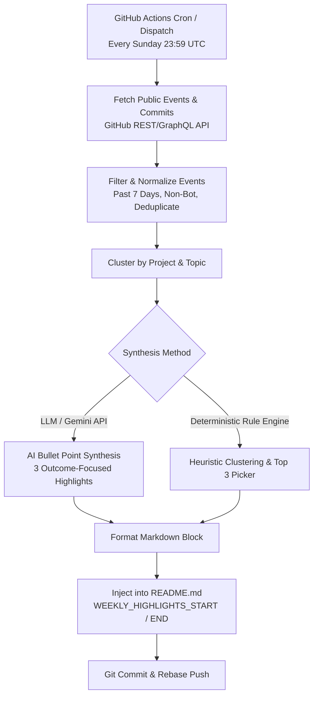
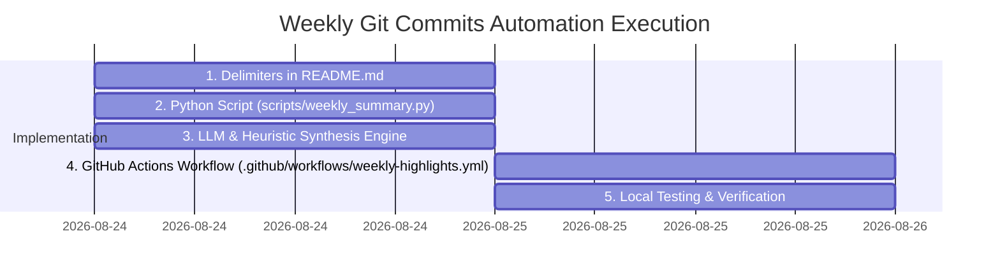

# Weekly Git Activity Automation Plan

## 1. Executive Summary

This plan outlines the architecture, data pipeline, synthesis logic, and GitHub Actions workflow for an automated weekly digest. The automation pulls public Git commits made over the past 7 days across public repositories, filters and clusters the activity, and synthesizes exactly **three high-impact bullet points** summarizing what was accomplished during the week.

The summary is automatically injected into `README.md` between dedicated template comment delimiters on a weekly schedule (or on-demand via `workflow_dispatch`).

---

## 2. System Architecture & Flow



---

## 3. Data Collection Pipeline

### 3.1 Data Source Options

1. **GitHub Events API (`GET /users/{username}/events/public`)**
   - **Pros:** Returns the latest 300 public events across all public repositories without needing individual repo permissions.
   - **Payload:** Captures `PushEvent` objects containing commit hashes, commit messages, repository names, and timestamps.
   - **Limitation:** Events older than 90 days or beyond the latest 300 events are truncated (sufficient for a 7-day lookback).

2. **GitHub Search Commits API (`GET /search/commits`)**
   - **Query:** `author:{username} committer-date:>YYYY-MM-DD`
   - **Pros:** Precise date range querying directly for commit objects.
   - **Headers:** Requires `Accept: application/vnd.github.cloak-preview+json`.

### 3.2 Filtering & Noise Reduction Rules

To ensure high-quality summarization:
- **Time Window:** Filter events strictly within `[now() - 7 days, now()]`.
- **Ignore Automated / Bot Commits:**
  - Messages matching patterns like `chore(deps):`, `bump .* from .* to .*`, `chore(almanac):`, `[skip ci]`.
  - Commits authored by bots (`github-actions[bot]`, `dependabot[bot]`, `renovate[bot]`).
- **Exclude Empty & Merge Commits:** Exclude default PR merge commits (`Merge branch '...' of ...`).
- **Deduplication:** Group squash/rebase commits by unique commit SHA and message body.

---

## 4. Synthesis & Bullet Generation

The core requirement is condensing dozens of granular commits into **3 clean, outcome-focused bullet points**.

### 4.1 Approach A: LLM-Driven Synthesis (Recommended)

Using a lightweight model (e.g. Gemini 2.5 Flash / Workers AI / GitHub Models API):

- **Input Prompt:**
  ```text
  You are an expert technical editor. Given the following raw git commits made by Harlan Jones over the past 7 days across his public GitHub repositories, extract and synthesize EXACTLY 3 high-impact bullet points describing what he built, improved, or shipped this week.
  
  Guidelines:
  1. Return exactly 3 markdown bullet points.
  2. Focus on technical impact, architecture, and features rather than trivial chores.
  3. Include repository names or bold topic tags where relevant (e.g., "**urban-signal:** ...").
  4. Keep each bullet concise (1-2 sentences).
  5. If fewer than 3 major features exist, summarize active exploration, refactoring, or maintenance focus.
  
  Raw Commits:
  {formatted_commit_list}
  ```

### 4.2 Approach B: Deterministic Heuristic Fallback (Zero External API Dependency)

If an LLM API key is not configured or fails:
1. **Cluster commits by repository** and calculate activity score ($S = \text{commits} + \text{unique message tokens}$).
2. **Extract top 3 active repositories**.
3. **Parse Conventional Commit prefixes** (`feat:`, `perf:`, `fix:`, `refactor:`) to extract the most descriptive commit messages for each top repo.
4. **Fallback for zero-commit weeks:** Display a graceful fallback status (e.g., *"Architecture research & internal workspace maintenance"*).

---

## 5. Markdown Injection Strategy

Add injection delimiters to `README.md`:

```markdown
<!-- WEEKLY_HIGHLIGHTS_START -->
### ⚡ What I Did This Week (Aug 17 – Aug 24, 2026)

* **urban-signal:** Implemented real-time H3 spatio-temporal grid indexing and Kafka telemetry streaming pipelines.
* **scheme-db:** Added Catmull-Rom spline path interpolation for animated NFL pass coverage disguise schemes.
* **clify:** Designed metric-driven agent orchestration SLAs with sub-2.5s execution benchmarks and TDD coverage.
<!-- WEEKLY_HIGHLIGHTS_END -->
```

The updater script uses regex string replacement to cleanly update content between the markers without disturbing the rest of `README.md`.

---

## 6. Implementation Plan & File Structure

### 6.1 Proposed Directory Layout

```
.
├── .github/
│   └── workflows/
│       ├── mlb-birthdays.yml
│       ├── profile-summary-cards.yml
│       └── weekly-highlights.yml     <-- New GitHub Actions workflow
├── scripts/
│   ├── mlb_birthdays.py
│   └── weekly_summary.py             <-- New Python aggregation & synthesis script
├── README.md                          <-- Add delimiter tags
└── requirements.txt (or inline standard library deps)
```

### 6.2 Step-by-Step Execution Plan



#### Step 1: Delimiters in `README.md`
- Insert `<!-- WEEKLY_HIGHLIGHTS_START -->` and `<!-- WEEKLY_HIGHLIGHTS_END -->` in a prominent section of `README.md` (e.g. under "Professional Overview" or above "Featured Projects").

#### Step 2: Build `scripts/weekly_summary.py`
- Implements:
  - `fetch_github_commits(username, token, lookback_days=7)`
  - `filter_and_cluster_commits(events)`
  - `synthesize_highlights(clusters, gemini_api_key=None)`
  - `format_markdown_block(highlights, date_range)`
  - `update_readme(readme_path, markdown_block)`

#### Step 3: Build `.github/workflows/weekly-highlights.yml`
- Trigger on cron schedule (`0 0 * * 1` — every Monday at 00:00 UTC) and `workflow_dispatch`.
- Permissions: `contents: write`.
- Runs `python3 scripts/weekly_summary.py --username harlanljones`.
- Commits and pushes with retry/rebase logic identical to the robust `mlb-birthdays.yml` pattern.

#### Step 4: Testing & Edge Case Verification
- Verify rate limiting handling with `GITHUB_TOKEN`.
- Test `--dry-run` flag to preview output without modifying `README.md`.
- Test handling of quiet weeks (0 commits) and heavy weeks (100+ commits).

---

## 7. Configuration & Secrets

| Variable / Secret | Required | Description |
| :--- | :--- | :--- |
| `GITHUB_TOKEN` | Yes (Automatic) | Default workflow token used for GitHub API queries and committing changes. |
| `GEMINI_API_KEY` | Optional | For AI-powered synthesis. If omitted, falls back to deterministic heuristic clustering. |

---

## 8. Next Steps

When ready to proceed:
1. Add the markdown delimiters to `README.md`.
2. Implement `scripts/weekly_summary.py` with both LLM synthesis and robust deterministic fallback.
3. Add `.github/workflows/weekly-highlights.yml`.
4. Run a local test dry-run against the public commits from the past week.
